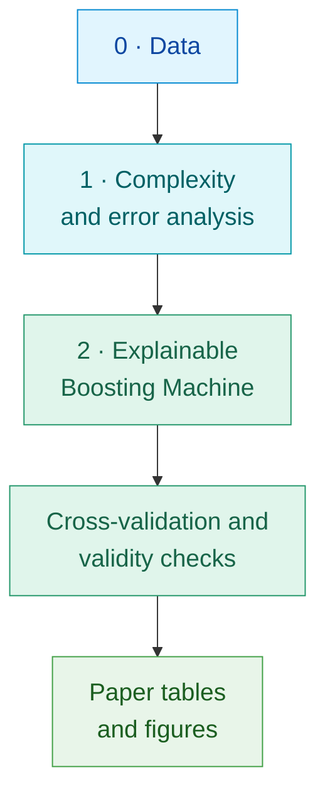
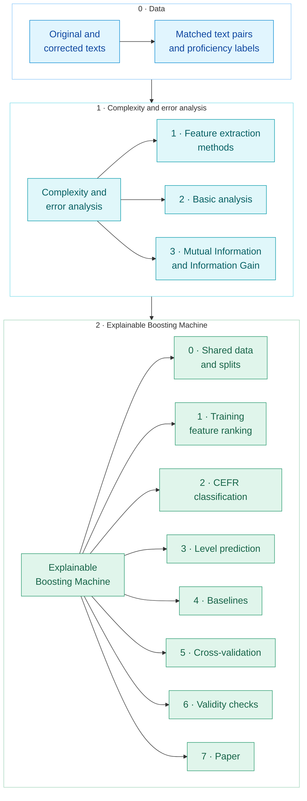
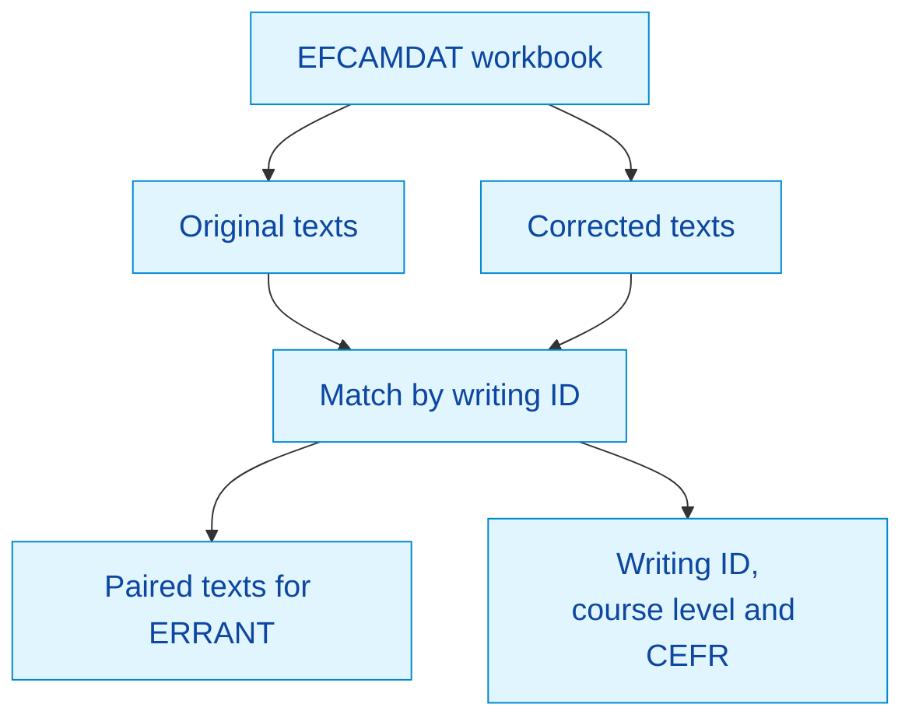
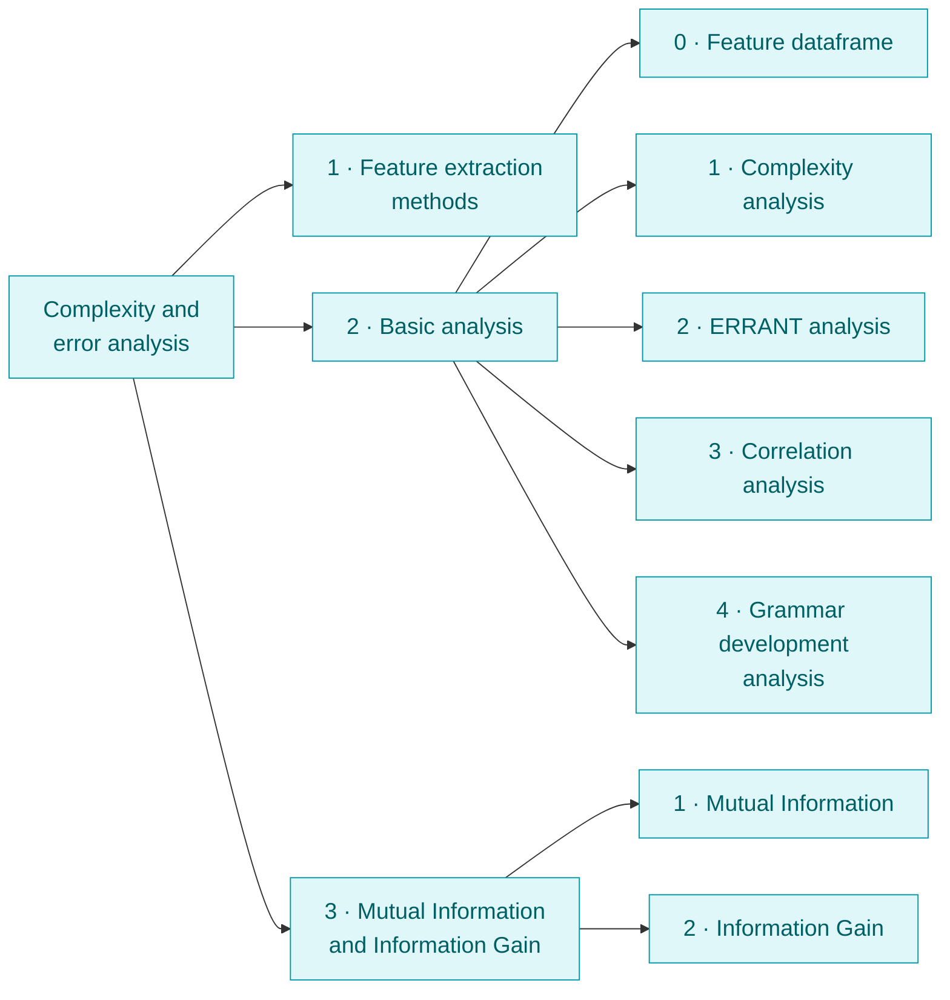
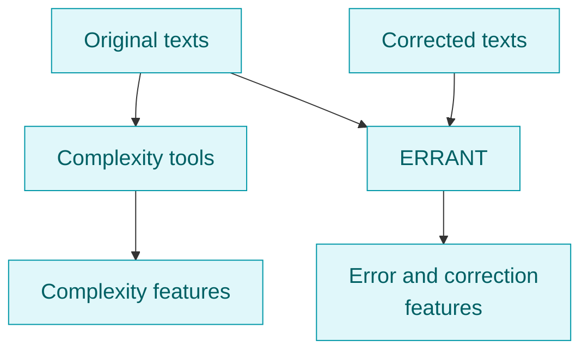
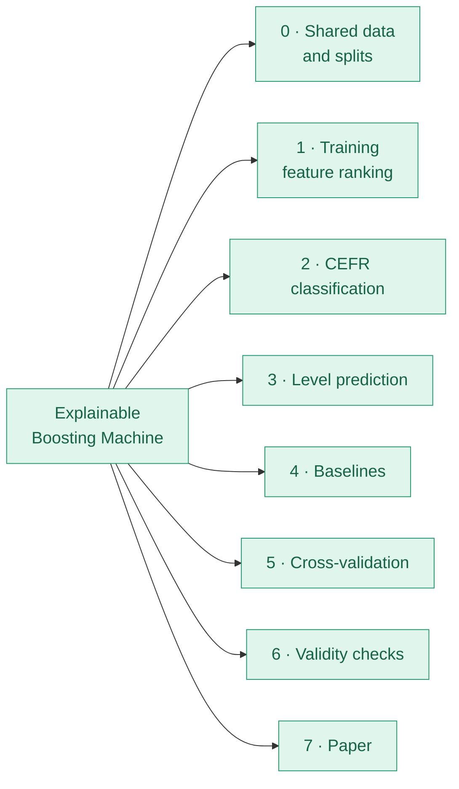
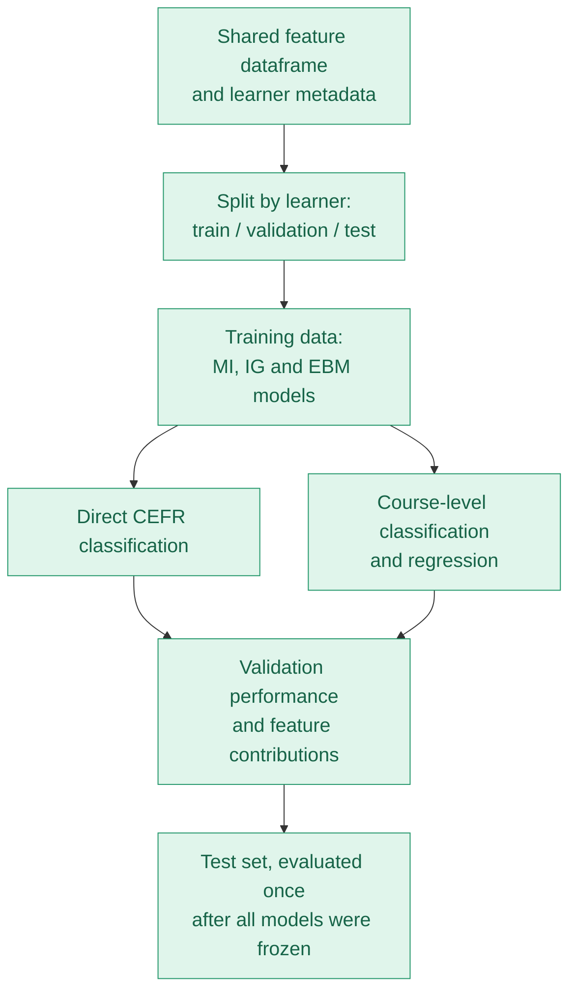

# CEFR Level Prediction with Explainable Boosting Machines

## Purpose of This Repo

This repo is for demonstration and reproducibility of the paper *CEFR Level Prediction with Explainable Boosting Machines* (submitted to NLP4CALL 2026). It contains the scripts and the aggregated results behind every table and figure in the paper.

## Paper Objective

The paper asks three questions:

1. How accurately do linguistic complexity and accuracy features predict CEFR bands and the more detailed course levels of learner texts?
2. Which linguistic dimensions contribute to the models' predictions, and how do their contributions vary across levels?
3. How well do the models generalise to writing tasks excluded from training?

It is a first step towards post-training LLMs that estimate a learner's level and respond within it: before linguistic level profiles can guide such models, we need to know what the profiles describe and how far they transfer.

## Project Overview

| Project detail | Description |
| --- | --- |
| Dataset | Cleaned EFCAMDAT subcorpus (main prompts): 406,062 learner texts by 89,589 learners |
| Level labels | Course levels 1–15 and their CEFR bands A1–C1; 8 writing tasks per level, 120 in total |
| Prediction models | Explainable Boosting Machine (EBM) classifiers and regressors (InterpretML 0.7.8) |
| Feature inventory | 1,784 values from six tools; 16 feature configurations |
| Evaluation | Learner-disjoint 70/15/15 split, 10-fold cross-validation, two task-withholding experiments |
| Complexity tools | LCA, L2SCA, TAASSC, TAALES, POLKE |
| Error analysis | ERRANT |

### Key Results

| Question | Result |
| --- | --- |
| Accuracy for new learners | 97.7% CEFR accuracy (macro F1 0.956) and 94.4% exact-level accuracy on the held-out test set; ten-fold CV gives the same picture |
| Effect of removing length-related features | Almost none: the main model without counts and length-dependent measures reaches 97.6% CEFR accuracy |
| Which dimensions matter | Lexical sophistication (53%), syntactic complexity (22%), grammatical constructions (18%); constructions lead only for level 1, vocabulary for all higher levels |
| Transfer to unseen writing tasks | Much weaker: exact-level macro F1 falls to 0.19 and CEFR accuracy to 0.71 (0.78 for the regressor) |

## Process

<details>
<summary><b>Main Modules Flowchart</b></summary>



</details>

<details>
<summary><b>Detailed Flowchart</b></summary>

This chart shows the main stages and their contents. Within each module, numbered labels match its folder structure.



</details>

<details>
<summary><b>0_Data</b></summary>



The data come from the cleaned EFCAMDAT subcorpus of Shatz (2020), file *Final database (main prompts)*. It contains texts written by learners of English in an online course. This project uses 406,062 texts.

Each text has:

- A unique writing ID and a learner ID.
- A course-level label from 1 to 15, mapped to its CEFR band (levels 1–3 A1, 4–6 A2, 7–9 B1, 10–12 B2, 13–15 C1).
- A writing-task ID: every level has 8 tasks, and every task belongs to exactly one level.
- An original learner-written version and a corrected version for error analysis.

The texts are **not included** because of the data licence; they can be requested from the EF Research Lab (<https://ef-lab.mml.cam.ac.uk/EFCAMDAT.html>). [Data_To_Txt_Files.py](0_Data/Data_To_Txt_Files.py) exports the original and corrected texts from the workbook, and [level_and_cefr_counts.xml](0_Data/level_and_cefr_counts.xml) gives the number of texts per level and band.

</details>

<details>
<summary><b>1_Complexity_Analysis_Full_Module</b></summary>

This module extracts linguistic measurements, combines them into one row per text, and describes how those measurements relate to proficiency. Its shared dataframe is the input to the EBM experiments.

#### Folder Map



#### Linguistic Feature and Error Extraction



| Tool | What it measures | Outputs used |
| --- | --- | --- |
| TAALES 2.2 | Lexical sophistication from frequency lists, psycholinguistic norms and n-gram measures | 485 indices and 352 coverage values |
| LCA | Lexical density, diversity and sophistication | 33 |
| L2SCA (release 2023-08-15) | Size and organisation of syntactic units | 23 |
| TAASSC 2.0.0.58 | Clausal, phrasal and syntactic-sophistication measures | 149 |
| POLKE | Rates of 667 English Grammar Profile constructions per 100 words, plus 3 text-size measures | 670 |
| ERRANT 3.0.2 | Edits between original and corrected texts, mostly error rates per 100 words by error type | 72 |

The six tools give **1,784 values** in total. The run scripts are in [1_Complexity_Analysis_Methods](1_Complexity_Analysis_Full_Module/1_Complexity_Analysis_Methods): `run_LCA.py`, `run_L2SCA.py`, `run_TAASSC.py`, `run_ERRANT.py`, POLKE's `polke-main/run_POLKE.py` and the [TAALES automation](1_Complexity_Analysis_Full_Module/1_Complexity_Analysis_Methods/TAALES/TAALES-Reliable-Automation). The tools themselves are not included; the note in each tool folder explains where to get them and where to place them. LCA, TAASSC and ERRANT use spaCy 3.8.14 with `en_core_web_sm` 3.8.0. Before parsing, L2SCA input is sentence-segmented and long segments are split into chunks of at most 45 words; POLKE falls back to chunking when a sentence reaches 120 words.

#### Shared Feature Dataframe

[create_dataframe.py](1_Complexity_Analysis_Full_Module/2_Basic_Analysis/0_Feature_Dataframe/create_dataframe.py) combines the tool results into one dataframe, one row per learner text:

```text
text_id | cefr_level | complexity features ... | accuracy/error features ...
```

The dataframe has one row per text and is therefore not included. [feature_dictionary.csv](1_Complexity_Analysis_Full_Module/2_Basic_Analysis/0_Feature_Dataframe/feature_dictionary.csv) explains every feature's name, source and group, and [dataframe_summary.json](1_Complexity_Analysis_Full_Module/2_Basic_Analysis/0_Feature_Dataframe/dataframe_summary.json) summarises its contents.

#### Descriptive Analyses

| Analysis | Main result files to inspect |
| --- | --- |
| Complexity | [complexity_stats.csv](1_Complexity_Analysis_Full_Module/2_Basic_Analysis/1_Complexity_Analysis/complexity_stats.csv) and [complexity_level_stats.csv](1_Complexity_Analysis_Full_Module/2_Basic_Analysis/1_Complexity_Analysis/complexity_level_stats.csv): overall and course-level feature summaries. |
| Errors | [errant_basic_stats.csv](1_Complexity_Analysis_Full_Module/2_Basic_Analysis/2_Errant_Analysis/errant_basic_stats.csv) and [errant_error_type_summary.csv](1_Complexity_Analysis_Full_Module/2_Basic_Analysis/2_Errant_Analysis/errant_error_type_summary.csv): error rates and error-type patterns. Spelling, orthography and spacing make up about 90% of the 1,105,310 edits. |
| Correlations | [combined_feature_level_correlations.csv](1_Complexity_Analysis_Full_Module/2_Basic_Analysis/3_Correlation_Analysis/combined_feature_level_correlations.csv) and [feature_feature_correlations.csv](1_Complexity_Analysis_Full_Module/2_Basic_Analysis/3_Correlation_Analysis/feature_feature_correlations.csv): feature–level and feature–feature relationships. |
| Grammar development | [grammar_usage_by_level.csv](1_Complexity_Analysis_Full_Module/2_Basic_Analysis/4_Grammar_Development_Analysis/grammar_usage_by_level.csv) and [grammar_progression.csv](1_Complexity_Analysis_Full_Module/2_Basic_Analysis/4_Grammar_Development_Analysis/grammar_progression.csv): how often each POLKE structure is used at each level. |
| Mutual Information and Information Gain | [mutual_information_scores.csv](1_Complexity_Analysis_Full_Module/3_Mutual_Information_And_Information_Gain/1_Mutual_Information/mutual_information_scores.csv) and [information_gain_scores.csv](1_Complexity_Analysis_Full_Module/3_Mutual_Information_And_Information_Gain/2_Information_Gain/information_gain_scores.csv): how informative each feature is about course level on its own. The EBM pipeline computes its own rankings on training texts only. |

#### Length-Dependent Features

Many measures grow with the amount a learner wrote rather than with proficiency: a 200-word text has more chances to contain different words or structures than a 50-word text, and a type-token ratio falls as a text gets longer. Such **length-dependent features** can predict proficiency without validly measuring it. Two lists define them, both derived from the training texts only.

| List | Contents |
| --- | --- |
| [blacklist_1_direct_length_features.csv](1_Complexity_Analysis_Full_Module/blacklist_1_direct_length_features.csv) | 9 direct size measures: the number of words or different words, from LCA, L2SCA, TAASSC, TAALES and POLKE. |
| [blacklist_2_length_correlated_features.csv](1_Complexity_Analysis_Full_Module/blacklist_2_length_correlated_features.csv) | 36 other length-dependent features: 22 raw counts of units other than words (sentences, clauses, T-units, sophisticated words, constructions, raw error counts) and 14 measures whose Spearman correlation with word count within each course level, averaged over levels and weighted by their number of training texts, has an absolute value of at least 0.3. Most of the 14 are type-token ratios and diversity measures computed over 50-word windows or samples. |

The **main** feature set of the paper excludes both lists. Rates per 100 words adjust for length and are kept. Just below the cut-off, TAASSC `nonfinite_prop` (0.27) and `mltu` (0.22) are kept.

#### Duplicate Features

[blacklist_3_duplicate_features.csv](1_Complexity_Analysis_Full_Module/blacklist_3_duplicate_features.csv) lists 535 features whose rank order over the 284,752 training texts correlates with a kept feature at \|Spearman ρ\| ≥ 0.95; 123 of them are exact duplicates, such as a measure and its log. Most are TAALES coverage values (306) and TAALES indices (151). The **strictest** feature set of the paper excludes them as well as both length lists.

</details>

<details>
<summary><b>2_Explainable_Boosting_Machine</b></summary>

This stage tests how well linguistic complexity and error features predict proficiency, which linguistic dimensions the models use, and how far their performance transfers to new writing tasks.

#### Folder Map



#### Training and Evaluation Workflow



Learners are assigned to **70% training, 15% validation and 15% test** data by `sha256("42:<learner_id>")`: the first 16 hex digits divided by 2^64 give a number below 0.70 for training, below 0.85 for validation and otherwise test. All texts of one learner stay in the same split, and both prediction tasks share it. The split file itself lists learner IDs and is not included.

#### Prediction Models

An EBM is a generalised additive model: it learns one contribution curve per feature and adds the contributions up, so every prediction can be broken down exactly into feature contributions. All models use 200 boosting rounds, learning rate 0.04, 128 bins per feature, 50 smoothing rounds, one outer bag, no pairwise interactions, no early stopping and seed 42.

| Model name | Description |
| --- | --- |
| CEFR classifier | Predicts a CEFR band directly. |
| Level classifier | Predicts one of course levels 1–15. For CEFR evaluation, the probabilities of the three levels of each band are added together; this gives better CEFR results than the direct CEFR classifier. |
| Level regressor | Predicts a numerical course level. MAE uses the continuous predictions (clipped to 1–15); the other metrics use them rounded to the nearest level. |
| Majority classifier / median regressor | Always predict the most common training class or the median training level. Baselines without linguistic features. |

Classifiers use balanced sample weights to handle the strong class imbalance (C1 is about 1.3% of the texts).

#### Feature-Set Experiments

Each of the three prediction methods is trained on 16 configurations, **48 runs in total**. In `classifier__combined`, `classifier` identifies the model type and `combined` the feature set. Features with fewer than 20 training observations or no variation are dropped before fitting.

| Experiment name | Description |
| --- | --- |
| `combined` | All complexity and error features (1,719 after filtering). |
| `combined_without_length_features` | Without the 9 direct length measures of list 1. |
| `combined_without_length_correlated_features` | Without both length lists (1,675 features). The **main model** of the paper. |
| `combined_without_duplicate_features`, `combined_without_length_and_duplicate_features` | Without the duplicate list, alone or together with list 1. |
| `combined_without_length_correlated_and_duplicate_features` | Without both length lists and the duplicates (1,158 features). The **strictest** model. |
| `combined_plus_error_composition` | Adds relative error proportions (missing, unnecessary, replacement, other) to `combined`. |
| `complexity`, `complexity_without_length_features`, `complexity_without_length_correlated_features` | The same without the ERRANT features. |
| `polke` | POLKE constructions only. |
| `accuracy` | ERRANT error features only. |
| `training_mutual_information_features`, `training_information_gain_features` | The 200 features ranked highest by MI or IG on the training texts. |
| `length_only` | Only the 9 direct length measures. |
| `majority` / `median` | Baselines. |

#### Folders and Important Result Files

| Folder | What it contains and how to use it |
| --- | --- |
| [0_Shared_Data_And_Splits](2_Explainable_Boosting_Machine/0_Shared_Data_And_Splits) | [ebm_workflow.py](2_Explainable_Boosting_Machine/0_Shared_Data_And_Splits/ebm_workflow.py) holds the shared training and reporting code. The manifest, feature definitions and experiment definitions record the inputs; [final_evaluation.json](2_Explainable_Boosting_Machine/0_Shared_Data_And_Splits/final_evaluation.json) seals the models that were evaluated on the test set. |
| [1_Training_Feature_Ranking](2_Explainable_Boosting_Machine/1_Training_Feature_Ranking) | [training_feature_ranking.xlsx](2_Explainable_Boosting_Machine/1_Training_Feature_Ranking/training_feature_ranking.xlsx): training-only MI and IG scores and ranks, and which features each method selected. |
| [2_CEFR_Classification](2_Explainable_Boosting_Machine/2_CEFR_Classification) | Direct CEFR classifiers: performance and feature contributions of all models. |
| [3_Level_Prediction](2_Explainable_Boosting_Machine/3_Level_Prediction) | Level classifiers and regressors, with exact-level and derived CEFR performance, and feature contributions. |
| [4_Baselines](2_Explainable_Boosting_Machine/4_Baselines) | The [CEFR leaderboard](2_Explainable_Boosting_Machine/4_Baselines/1_Leaderboards/cefr_leaderboard.csv), the [level leaderboard](2_Explainable_Boosting_Machine/4_Baselines/1_Leaderboards/level_leaderboard.csv) and [baseline_improvements.csv](2_Explainable_Boosting_Machine/4_Baselines/2_Model_Comparisons/baseline_improvements.csv), with bootstrap standard deviations over learners. |
| [5_Cross_Validation](2_Explainable_Boosting_Machine/5_Cross_Validation) | 10-fold cross-validation: the fold manifest, one folder per job and the summaries (see Cross-Validation below). |
| [6_Validity_Checks](2_Explainable_Boosting_Machine/6_Validity_Checks) | The half-task split, the performance by text length and the one-task-per-level holdout (see Validity Checks below). |
| [7_Paper](2_Explainable_Boosting_Machine/7_Paper) | The paper's tables and figures, built by `paper_tables.py` (see Paper Tables and Figures below). |

In `2_CEFR_Classification` and `3_Level_Prediction`, the `0_All_Experiments` folders in `2_Prediction_Performance` and `3_Feature_Contributions` hold every model in one table. The full pipeline also writes one folder per model; they repeat these tables and are left out here to keep file paths short.

| Report | What to inspect |
| --- | --- |
| `performance_metrics_<task>_all_experiments.csv` | Accuracy, macro F1, ordinal MAE, QWK and other metrics of every model, each with its standard deviation. Check `evaluated_target` and `split` before comparing rows. |
| `per_cefr_metrics_<task>_all_experiments.csv` / `per_level_metrics_<task>_all_experiments.csv` | Precision, recall, F1 and support for each CEFR band or course level. |
| `CEFR_classifications_cefr_all_experiments.csv` / `level_classifications_level_all_experiments.csv` | Actual versus predicted counts, with the percentage of each actual class. |
| `feature_contributions_<task>_all_experiments.csv` | Mean absolute contribution of every feature to every model output. Filter `experiment` and `output`. |
| `tool_contributions_<task>_all_experiments.csv` | How strongly each tool's features together move each output's score on the validation texts. |

Feature contributions show influence, not the direction of an effect, and do not establish that a feature causes proficiency. Tool and dimension contributions add up a group's feature contributions for each text before taking the absolute value, so features of the same group that offset each other are not double-counted.

#### Cross-Validation

The main results come from one learner split. [cross_validation.py](2_Explainable_Boosting_Machine/5_Cross_Validation/cross_validation.py) repeats the key experiments on 10 folds to show how much the results vary with the training texts, and to test differences between models properly.

- **Folds:** the 344,982 training and validation texts are split into 10 folds, grouped by learner and stratified by course level (seed 42). The test texts are never read. The fold assignments list text IDs and are not included; [fold_manifest.json](2_Explainable_Boosting_Machine/5_Cross_Validation/1_Folds/fold_manifest.json) records how they were made.
- **Fits:** each fold trains on about 310,000 texts and is evaluated on the other 34,500, with the same code and settings as the main runs. The length and duplicate lists are applied as fixed feature definitions.
- **Paper run:** the level classifier and regressor of `combined` and of the main model, plus the majority and median baselines: 60 jobs in [jobs.csv](2_Explainable_Boosting_Machine/5_Cross_Validation/2_Jobs/jobs.csv). Each job folder in `2_Jobs` holds its metrics, excluded features, feature importance and tool and dimension contributions.

| Result file in [3_Results](2_Explainable_Boosting_Machine/5_Cross_Validation/3_Results) | Contents |
| --- | --- |
| `cv_summary.csv` | Each model's mean and standard deviation over the folds for every metric. |
| `cv_comparisons.csv` | Model differences tested with the Nadeau–Bengio corrected resampled t-test, which accounts for the overlap between the folds' training sets. |
| `cv_fold_metrics.csv` | Every metric for every model and fold. |
| `cv_per_class_metrics.csv` | Precision, recall and F1 for each course level and CEFR band. |
| `cv_confusion_matrices.csv` | Actual versus predicted labels, pooled over the folds. |
| `cv_tool_shares.csv` / `cv_dimension_shares.csv` | Each tool's or linguistic dimension's share of the contributions, per output and overall, with standard deviations over folds. |
| `cv_feature_stability.csv` | Each feature's mean importance, mean rank and number of folds in which it is among a model's 20 most important features. |

The main classifier reaches level macro F1 0.900 ± 0.006 against 0.902 ± 0.006 with all features (corrected t-test p = 0.10), and CEFR macro F1 0.953 against 0.955 (p < 0.001). The main regressor's MAE is 0.619 against 0.604 levels (p < 0.001).

#### Validity Checks

Every EFCAMDAT writing task belongs to one course level, so a model could learn to recognise the task instead of the learner's proficiency. [validity_checks.py](2_Explainable_Boosting_Machine/6_Validity_Checks/validity_checks.py) tests this, and whether removing length features costs accuracy on short or long texts.

- **Half-task split (`topic`):** the all-feature, main and strictest models are retrained on the training texts of 4 of the 8 tasks per level, then on the other 4, and evaluated on validation texts of seen and unseen tasks. Results: [topic_check_results.csv](2_Explainable_Boosting_Machine/6_Validity_Checks/1_Topic_Check/topic_check_results.csv) and [topic_check_gaps.csv](2_Explainable_Boosting_Machine/6_Validity_Checks/1_Topic_Check/topic_check_gaps.csv).
- **Length check (`length`):** performance of each main model and of the length-only baseline for texts of 0–49, 50–99, 100–149, 150–199 and 200 or more words, in [performance_by_text_length.csv](2_Explainable_Boosting_Machine/6_Validity_Checks/2_Length_Check/performance_by_text_length.csv).
- **One-task-per-level holdout (`tasks`):** eight versions of the main models, each trained without one task per level, so that every validation text is predicted by a model that never saw its task. Results: [task_check_summary.csv](2_Explainable_Boosting_Machine/6_Validity_Checks/3_Leave_One_Task_Out/task_check_summary.csv) and, per fold, [task_check_folds.csv](2_Explainable_Boosting_Machine/6_Validity_Checks/3_Leave_One_Task_Out/task_check_folds.csv).

Trained on 4 of the 8 tasks per level, the main classifier reaches level macro F1 0.943 on seen tasks but 0.176 on unseen ones (CEFR accuracy 0.987 and 0.662). The all-feature and strictest models show the same gap, so removing length-dependent features does not remove the dependence on the task. Leaving out only one task per level barely helps: pooled over the 8 folds, the main classifier reaches level macro F1 0.187 and CEFR accuracy 0.710 on unseen tasks, and the regressor CEFR accuracy 0.782. The length bins show no such problem: the filtered models match the full model on short and long texts.

#### Paper Tables and Figures

| Folder or file | Contents |
| --- | --- |
| [paper_tables.py](2_Explainable_Boosting_Machine/7_Paper/paper_tables.py) | Collects the tables and figures from the results above; it can be rerun whenever results change. |
| [1_Tables](2_Explainable_Boosting_Machine/7_Paper/1_Tables) | All paper tables as CSV, plus [paper_tables.md](2_Explainable_Boosting_Machine/7_Paper/1_Tables/paper_tables.md) and `paper_tables.tex` with all of them together. |
| [2_Figures](2_Explainable_Boosting_Machine/7_Paper/2_Figures) | Dimension and tool shares by level, confusion matrices, performance by text length and F1 by level (PNG and PDF). |

Where each part of the paper comes from:

| Paper content | File(s) |
| --- | --- |
| Data and splits | [table_1_data.csv](2_Explainable_Boosting_Machine/7_Paper/1_Tables/table_1_data.csv), [level_and_cefr_counts.xml](0_Data/level_and_cefr_counts.xml) |
| Feature sets and their sizes | [table_2_feature_sets.csv](2_Explainable_Boosting_Machine/7_Paper/1_Tables/table_2_feature_sets.csv) and the three `blacklist_*.csv` lists |
| Validation and test results of all 16 configurations | [table_3_validation_results.csv](2_Explainable_Boosting_Machine/7_Paper/1_Tables/table_3_validation_results.csv), [table_5_test_results.csv](2_Explainable_Boosting_Machine/7_Paper/1_Tables/table_5_test_results.csv) |
| Per-band and per-level test results | the `per_cefr_metrics` and `per_level_metrics` files in [3_Level_Prediction/2_Prediction_Performance/0_All_Experiments](2_Explainable_Boosting_Machine/3_Level_Prediction/2_Prediction_Performance/0_All_Experiments) |
| Cross-validation results | [5_Cross_Validation/3_Results](2_Explainable_Boosting_Machine/5_Cross_Validation/3_Results), [table_4_cross_validation.csv](2_Explainable_Boosting_Machine/7_Paper/1_Tables/table_4_cross_validation.csv) |
| Dimension and tool shares | `cv_dimension_shares.csv` and `cv_tool_shares.csv` in [5_Cross_Validation/3_Results](2_Explainable_Boosting_Machine/5_Cross_Validation/3_Results) |
| Stable individual features | `cv_feature_stability.csv`, [table_7_top_features.csv](2_Explainable_Boosting_Machine/7_Paper/1_Tables/table_7_top_features.csv) |
| Performance by text length | [table_8_length_check.csv](2_Explainable_Boosting_Machine/7_Paper/1_Tables/table_8_length_check.csv) |
| Unseen writing tasks | [table_9_topic_check.csv](2_Explainable_Boosting_Machine/7_Paper/1_Tables/table_9_topic_check.csv), [table_10_leave_one_task_out.csv](2_Explainable_Boosting_Machine/7_Paper/1_Tables/table_10_leave_one_task_out.csv) |

</details>

## How To Run

Run the commands below from the **repository root**.

### Python Environments

The project uses two pinned environments. Their exact package versions are listed in the [requirements](requirements) folder.

| Environment | Used for | Setup |
| --- | --- | --- |
| Python 3.10 | Feature extraction and descriptive analyses (ERRANT, spaCy, TAALES automation) | `py -3.10 -m venv venv/py310`, then `venv/py310/Scripts/python -m pip install -r requirements/feature_extraction_python310.txt` |
| Python 3.13 | EBM pipeline, cross-validation, validity checks and paper tables | `py -3.13 -m venv venv/py313`, then `venv/py313/Scripts/python -m pip install -r requirements/ebm_and_llm_python313.txt` |

Java, the TAALES application, and the LCA, L2SCA, TAASSC and POLKE code cannot be installed with pip; the notes in their folders explain where to get them. In the commands below, `python` means the Python of the matching environment.

### 1. Export the Texts

Place `Final database (main prompts).xlsx` in `0_Data`, then run:

```powershell
python "0_Data/Data_To_Txt_Files.py"
```

### 2. Extract the Features and Create the Shared Dataframe

Run the `run_*.py` scripts in [1_Complexity_Analysis_Methods](1_Complexity_Analysis_Full_Module/1_Complexity_Analysis_Methods) (and the TAALES automation), then:

```powershell
python "1_Complexity_Analysis_Full_Module/2_Basic_Analysis/0_Feature_Dataframe/create_dataframe.py"
```

### 3. Run the Complete EBM Pipeline

```powershell
python "2_Explainable_Boosting_Machine/run_ebm_pipeline.py"
```

It prepares the learner split, calculates the training rankings, trains the CEFR and level models of all 16 configurations, and writes the prediction and contribution reports and the leaderboards. Add `--skip-profile-scoring` to skip the reference profiles for later LLM work, which the paper does not use.

### 4. Run the Cross-Validation

```powershell
python "2_Explainable_Boosting_Machine/5_Cross_Validation/cross_validation.py" prepare --tasks level --experiments combined combined_without_length_correlated_features majority median
python "2_Explainable_Boosting_Machine/5_Cross_Validation/cross_validation.py" run --parallel 2
python "2_Explainable_Boosting_Machine/5_Cross_Validation/cross_validation.py" status
python "2_Explainable_Boosting_Machine/5_Cross_Validation/cross_validation.py" summarize
```

On a laptop (i9-11900H, 16 GB), a level classifier takes about two hours and a regressor about ten minutes. Near the end of each fit, InterpretML's memory use rises from about 2 GB to about 10 GB for roughly ten minutes, so run at most two fits in parallel on such a machine; `--workers 1` saves memory without changing the results.

### 5. Run the Validity Checks and Build the Paper Tables

```powershell
python "2_Explainable_Boosting_Machine/6_Validity_Checks/validity_checks.py" length
python "2_Explainable_Boosting_Machine/6_Validity_Checks/validity_checks.py" topic --workers 1 --memory 1GB
python "2_Explainable_Boosting_Machine/6_Validity_Checks/validity_checks.py" tasks --workers 1 --memory 1GB
python "2_Explainable_Boosting_Machine/7_Paper/paper_tables.py"
```

`--families` and `--folds` split the topic and task checks over several processes.

### Software Checks

To check the procedures on small synthetic data:

```powershell
python "2_Explainable_Boosting_Machine/2_CEFR_Classification/cefr_classification.py" test
python "2_Explainable_Boosting_Machine/5_Cross_Validation/cross_validation.py" test
```

## Open the Results

| What to check | File or location |
| --- | --- |
| All paper tables at once | [paper_tables.md](2_Explainable_Boosting_Machine/7_Paper/1_Tables/paper_tables.md) |
| Which models predict CEFR and course level best? | [cefr_leaderboard.csv](2_Explainable_Boosting_Machine/4_Baselines/1_Leaderboards/cefr_leaderboard.csv), [level_leaderboard.csv](2_Explainable_Boosting_Machine/4_Baselines/1_Leaderboards/level_leaderboard.csv) |
| How stable are the results across training data? | [cv_summary.csv](2_Explainable_Boosting_Machine/5_Cross_Validation/3_Results/cv_summary.csv), [cv_comparisons.csv](2_Explainable_Boosting_Machine/5_Cross_Validation/3_Results/cv_comparisons.csv) |
| Which linguistic dimensions and tools matter? | [cv_dimension_shares.csv](2_Explainable_Boosting_Machine/5_Cross_Validation/3_Results/cv_dimension_shares.csv), [cv_tool_shares.csv](2_Explainable_Boosting_Machine/5_Cross_Validation/3_Results/cv_tool_shares.csv) |
| Which individual features matter? | [cv_feature_stability.csv](2_Explainable_Boosting_Machine/5_Cross_Validation/3_Results/cv_feature_stability.csv), and the `feature_contributions` files in `3_Feature_Contributions/0_All_Experiments` |
| How well do the models transfer to new writing tasks? | [task_check_summary.csv](2_Explainable_Boosting_Machine/6_Validity_Checks/3_Leave_One_Task_Out/task_check_summary.csv), [topic_check_results.csv](2_Explainable_Boosting_Machine/6_Validity_Checks/1_Topic_Check/topic_check_results.csv) |

## Reproducibility

The EBM pipeline records the settings, code version and package versions of every trained model, with checksums of its files, and reuses a model only if all of them still match. The learner split, the cross-validation folds and the bootstrap resamples use a fixed seed (42). The test set was evaluated once, after all models were frozen, and [final_evaluation.json](2_Explainable_Boosting_Machine/0_Shared_Data_And_Splits/final_evaluation.json) records which models were evaluated.

The length and duplicate lists were derived from the original training split and are reused in the cross-validation folds and task holdouts, so the reported fold-to-fold variation does not include their reselection.

## Data and Third-Party Software

The EFCAMDAT texts, anything with one row per text or learner (per-text features, predictions, the learner split and the cross-validation folds), the trained models, and the code of the third-party tools are not shared in this repo. They need to be obtained from their original providers and used according to their access and licence conditions. The notes in the relevant folders explain which data and tools were used, where to get them, and where to place them.
